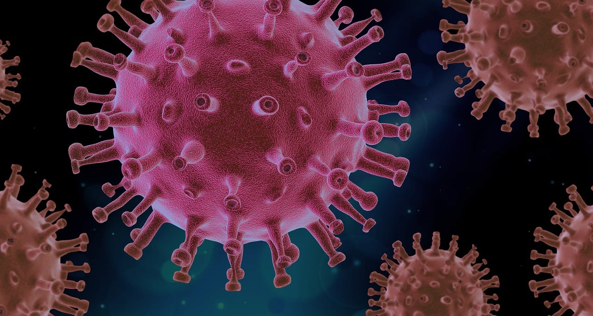

<div align="center">

# 🎓 Academic Projects Portfolio

> Machine Learning & Computer Vision Projects

[](https://github.com/sushiva/academic-projects)
[](https://python.org)
[](https://pytorch.org)

</div>

---

## 📂 Featured Projects

<table>
<tr>
<td width="50%" valign="top">

### 🏗️ [Safety Helmet Detection](https://github.com/sushiva/academic-projects/tree/main/academic/safety-helmet-detection)

[](https://github.com/sushiva/academic-projects/tree/main/academic/safety-helmet-detection)

**Binary image classification for workplace safety compliance**

- ✅ **Accuracy**: 100% (test set)
- 🧠 **Model**: ResNet18 Transfer Learning
- 📊 **Dataset**: 631 images (200×200×3)
- 🚀 **Tech**: PyTorch, torchvision, scikit-learn
- 🎯 **Use Case**: Automated safety monitoring

**Key Achievement**: 4-model comparison showing transfer learning achieves perfect accuracy with 20,000× fewer parameters than training from scratch.

[📖 View Project →](https://github.com/sushiva/academic-projects/tree/main/academic/safety-helmet-detection)

</td>
<td width="50%" valign="top">

### 🦠 [COVID-19 X-Ray Classification](https://github.com/sushiva/covid-xray-detection)

[](https://github.com/sushiva/covid-xray-detection)

**Multi-class X-ray image classification for COVID-19 diagnosis**

- ✅ **Accuracy**: 88.46% (test set)
- 🧠 **Model**: ANN with RGB preprocessing
- 📊 **Dataset**: 251 X-ray images (128×128×3)
- 🚀 **Tech**: TensorFlow, Keras, OpenCV
- 🎯 **Classes**: COVID-19, Viral Pneumonia, Normal

**Key Achievement**: Systematic comparison of 4 preprocessing techniques showing RGB images outperform grayscale, blur, and edge detection by 27-42%.

[📖 View Project →](https://github.com/sushiva/covid-xray-detection)

</td>
</tr>
</table>

## Setup

Each project contains its own README with specific setup instructions. Generally:

```bash
cd academic/[project-name]
python -m venv .venv
source .venv/bin/activate  # On Windows: .venv\Scripts\activate
pip install -r requirements.txt
```

## Documentation & Resources

This repository includes comprehensive guides and references in the [docs/](docs/) folder:

- **[SUMMARY.md](docs/SUMMARY.md)** - **START HERE** - Project overview and next steps
- [SETUP_GUIDE.md](docs/SETUP_GUIDE.md) - Complete setup instructions for all machines
- [FAQ.md](docs/FAQ.md) - Frequently asked questions and troubleshooting
- [ML_OPTIONS_GUIDE.md](docs/ML_OPTIONS_GUIDE.md) - Comprehensive ML techniques reference
- [APPROACH_COMPARISON.md](docs/APPROACH_COMPARISON.md) - Detailed comparison of different ML approaches
- [QUICK_COMPARISON.md](docs/QUICK_COMPARISON.md) - Visual quick reference for approach comparison

## Structure

```
academic-projects/
├── academic/
│   └── safety-helmet-detection/
│       ├── config/
│       ├── data/
│       ├── models/
│       ├── notebooks/
│       ├── outputs/
│       ├── src/
│       └── README.md
├── docs/                        ⭐ Documentation
│   ├── SUMMARY.md              (Start here)
│   ├── SETUP_GUIDE.md
│   ├── FAQ.md
│   ├── ML_OPTIONS_GUIDE.md
│   ├── APPROACH_COMPARISON.md
│   └── QUICK_COMPARISON.md
└── README.md
```
